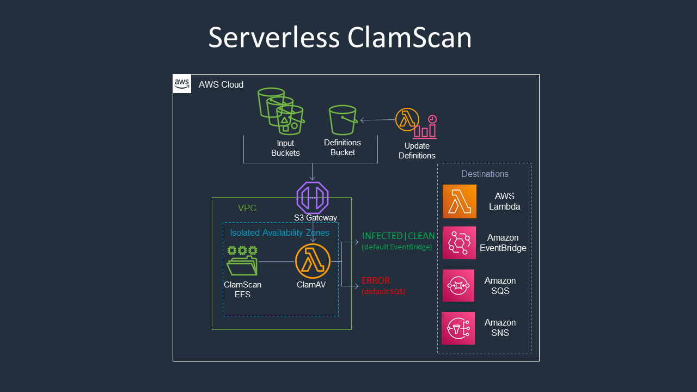

# cdk-serverless-clamscan

## cdk

[](https://badge.fury.io/py/cdk-serverless-clamscan)
[](https://badge.fury.io/js/cdk-serverless-clamscan)

## monocdk

[](https://badge.fury.io/py/monocdk-serverless-clamscan)
[](https://badge.fury.io/js/monocdk-serverless-clamscan)

An [aws-cdk](https://github.com/aws/aws-cdk) construct that uses [ClamAV®](https://www.clamav.net/) to scan objects in Amazon S3 for viruses. The construct provides a flexible interface for a system to act based on the results of a ClamAV virus scan.



## Pre-Requisites

**Docker:** The ClamAV Lambda functions utilizes a [container image](https://aws.amazon.com/blogs/aws/new-for-aws-lambda-container-image-support/) that is built locally using [docker bundling](https://aws.amazon.com/blogs/devops/building-apps-with-aws-cdk/)

## Examples

This project uses [projen](https://github.com/projen/projen) and thus all the constructs follow language specific standards and naming patterns. For more information on how to translate the following examples into your desired language read the CDK guide on [Translating TypeScript AWS CDK code to other languages](https://docs.aws.amazon.com/cdk/latest/guide/multiple_languages.html)

### Example 1. (Default destinations with rule target)

<details><summary>typescript</summary>
<p>

```typescript
import { RuleTargetInput } from '@aws-cdk/aws-events';
import { SnsTopic } from '@aws-cdk/aws-events-targets';
import { Bucket } from '@aws-cdk/aws-s3';
import { Topic } from '@aws-cdk/aws-sns';
import { Construct, Stack, StackProps } from '@aws-cdk/core';
import { ServerlessClamscan } from 'cdk-serverless-clamscan';

export class CdkTestStack extends Stack {
  constructor(scope: Construct, id: string, props?: StackProps) {
    super(scope, id, props);

    const bucket_1 = new Bucket(this, 'rBucket1');
    const bucket_2 = new Bucket(this, 'rBucket2');
    const bucketList = [bucket_1, bucket_2];
    const sc = new ServerlessClamscan(this, 'rClamscan', {
      buckets: bucketList,
    });
    const bucket_3 = new Bucket(this, 'rBucket3');
    sc.addSourceBucket(bucket_3);
    const infectedTopic = new Topic(this, 'rInfectedTopic');
    sc.infectedRule?.addTarget(
      new SnsTopic(infectedTopic, {
        message: RuleTargetInput.fromEventPath(
          '$.detail.responsePayload.message',
        ),
      }),
    );
  }
}
```

</p>
</details>

<details><summary>python</summary>
<p>

```python
from aws_cdk import (
  core as core,
  aws_events as events,
  aws_events_targets as events_targets,
  aws_s3 as s3,
  aws_sns as sns
)
from cdk_serverless_clamscan import ServerlessClamscan

class CdkTestStack(core.Stack):

  def __init__(self, scope: core.Construct, construct_id: str, **kwargs) -> None:
    super().__init__(scope, construct_id, **kwargs)

    bucket_1 = s3.Bucket(self, "rBucket1")
    bucket_2 = s3.Bucket(self, "rBucket2")
    bucketList = [ bucket_1, bucket_2 ]
    sc = ServerlessClamscan(self, "rClamScan",
      buckets=bucketList,
    )
    bucket_3 = s3.Bucket(self, "rBucket3")
    sc.add_source_bucket(bucket_3)
    infected_topic = sns.Topic(self, "rInfectedTopic")
    if sc.infected_rule != None:
      sc.infected_rule.add_target(
        events_targets.SnsTopic(
          infected_topic,
          message=events.RuleTargetInput.from_event_path('$.detail.responsePayload.message'),
        )
      )
```

</p>
</details>

### Example 2. (Bring your own destinations)

<details><summary>typescript</summary>
<p>

```typescript
import {
  SqsDestination,
  EventBridgeDestination,
} from '@aws-cdk/aws-lambda-destinations';
import { Bucket } from '@aws-cdk/aws-s3';
import { Queue } from '@aws-cdk/aws-sqs';
import { Construct, Stack, StackProps } from '@aws-cdk/core';
import { ServerlessClamscan } from 'cdk-serverless-clamscan';

export class CdkTestStack extends Stack {
  constructor(scope: Construct, id: string, props?: StackProps) {
    super(scope, id, props);

    const bucket_1 = new Bucket(this, 'rBucket1');
    const bucket_2 = new Bucket(this, 'rBucket2');
    const bucketList = [bucket_1, bucket_2];
    const queue = new Queue(this, 'rQueue');
    const sc = new ServerlessClamscan(this, 'default', {
      buckets: bucketList,
      onResult: new EventBridgeDestination(),
      onError: new SqsDestination(queue),
    });
    const bucket_3 = new Bucket(this, 'rBucket3');
    sc.addSourceBucket(bucket_3);
  }
}
```

</p>
</details>

<details><summary>python</summary>
<p>

```python
from aws_cdk import (
  core as core,
  aws_lambda_destinations as lambda_destinations,
  aws_s3 as s3,
  aws_sqs as sqs
)
from cdk_serverless_clamscan import ServerlessClamscan

class CdkTestStack(core.Stack):

  def __init__(self, scope: core.Construct, construct_id: str, **kwargs) -> None:
    super().__init__(scope, construct_id, **kwargs)

    bucket_1 = s3.Bucket(self, "rBucket1")
    bucket_2 = s3.Bucket(self, "rBucket2")
    bucketList = [ bucket_1, bucket_2 ]
    queue = sqs.Queue(self, "rQueue")
    sc = ServerlessClamscan(self, "rClamScan",
      buckets=bucketList,
      on_result=lambda_destinations.EventBridgeDestination(),
      on_error=lambda_destinations.SqsDestination(queue),
    )
    bucket_3 = s3.Bucket(self, "rBucket3")
    sc.add_source_bucket(bucket_3)
```

</p>
</details>

## Operation and Maintenance

When ClamAV publishes updates to the scanner you will see “Your ClamAV installation is OUTDATED” in your scan results. While the construct creates a system to keep the database definitions up to date, you must update the scanner to detect all the latest Viruses.

Update the docker images of the Lambda functions with the latest version of ClamAV by re-running `cdk deploy`.

## API Reference

See [API.md](./API.md).

## Contributing

See [CONTRIBUTING](./CONTRIBUTING.md) for more information.

## License

This project is licensed under the Apache-2.0 License.
